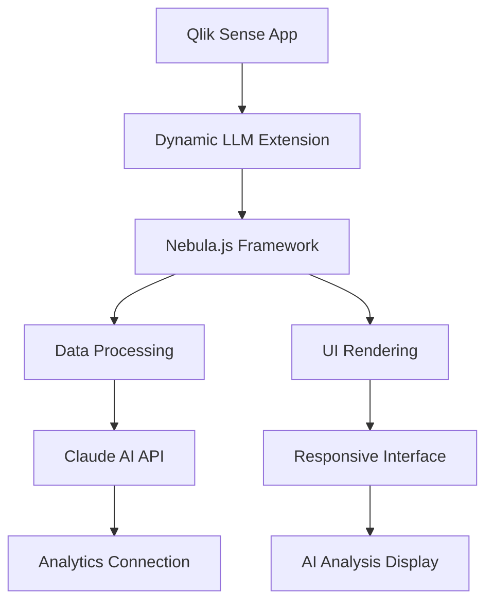

# Dynamic LLM Qlik Extension

A **compact, responsive** Qlik Sense extension that enables **AI-powered data analysis** directly within your Qlik applications using **Claude AI**. Built with **Nebula.js** for seamless integration and optimal performance.

## Features

### **Current Features (Phase 1)**
- **Responsive Design**: Scales dynamically with container size using modern CSS techniques
- **Claude AI Integration**: Powered by Anthropic's Claude 3.5 Sonnet model
- **Smart Data Highlighting**: Automatic highlighting of Qlik field names (blue) and numeric values (purple)
- **Real-time Analysis**: Generate AI insights with professional loading states
- **Dynamic Prompts**: Configurable system and user prompts with field mapping
- **Setup Wizard**: Step-by-step configuration with visual progress indicators
- **Advanced Parameters**: Temperature, Top K, Top P, and Max Tokens control
- **Professional UI**: Clean, modern interface with smooth transitions

### **Coming in Phase 2**
- **Prompt Assistant**: AI-powered prompt suggestions and optimization
- **Chat Interface**: Interactive conversation mode
- **Quick Actions**: Pre-built prompt templates
- **Advanced Field Mapping**: Enhanced data integration capabilities

## Requirements

### Prerequisites
- **Qlik Sense Cloud** with extension development access
- **Node.js** (v16+) and npm
- **Claude AI connection** configured in Qlik Cloud Analytics Connections
- **Nebula.js** framework

### Supported Data Types
- **Dimensions**: Up to 20 dimensions supported
- **Measures**: Up to 20 measures supported
- **Data Volume**: Optimized for datasets up to 100 rows (configurable)

## Installation

### Step 1: Clone & Install
```bash
git clone https://github.com/your-repo/qlik-extension-LLM.git
cd qlik-extension-LLM
npm install
```

### Step 2: Development
```bash
# Build the extension
npm run build

# The build creates optimized bundles in the /dist directory
```

### Step 3: Deploy to Qlik
1. Upload the built extension to your Qlik Cloud tenant
2. Enable in Management Console > Extensions
3. Add to any Qlik Sense app

## Configuration

### 1. Connection Setup
```yaml
Connection Type: Claude 3.5 Sonnet (External Connection)
Connection Name: Your_Claude_Connection_Name
Example: "Analytics:Anthropic_Claude35Sonnet_Business"
```

### 2. Data Configuration
- Add relevant **dimensions** (customer names, categories, etc.)
- Add relevant **measures** (KPIs, metrics, percentages)
- Data automatically appears in AI analysis

### 3. Advanced Parameters
| Parameter | Range | Default | Purpose |
|-----------|-------|---------|---------|
| **Temperature** | 0.0 - 2.0 | 0.7 | Controls response creativity |
| **Top K** | 1 - 500 | 250 | Limits token vocabulary |
| **Top P** | 0.0 - 1.0 | 1.0 | Nucleus sampling control |
| **Max Tokens** | 100 - 4000 | 1000 | Response length limit |

### 4. Selection Validation (Optional)
```javascript
// Example validation expression
Count(DISTINCT [Customer]) >= 1 AND Sum([Revenue]) > 0
```

### 5. Prompts & Field Mapping
#### System Prompt Example:
```
You are a helpful business intelligence assistant. Analyze the provided data and generate exactly three bullet points with key insights, trends, and actionable recommendations.
```

#### User Prompt Example:
```
Analyze the sales performance for [Product_Name] in [Region] for the current period.

Based on the data provided:
[Field mappings will be inserted here]

Please interpret the metrics and provide insights about performance trends and opportunities for improvement.
```

## Responsive Design

The extension adapts to any container size:

- **Large containers**: Full-sized elements and optimal spacing
- **Medium containers**: Proportionally scaled components
- **Small containers**: Compact layout with maintained readability

### CSS Techniques Used:
```css
/* Responsive typography */
font-size: clamp(11px, 1.8vw, 13px);

/* Flexible spacing */
padding: clamp(4px, 0.6vh, 6px) clamp(6px, 1vw, 8px);

/* Adaptive elements */
width: clamp(20px, 3vw, 24px);
```

## Usage Workflow

### Quick Start (3 Steps):
1. **Configure Connection** → Set your Claude AI connection name
2. **Add Data Fields** → Select dimensions and measures  
3. **Configure Prompts** → Set up system and user prompts

### Generate Analysis:
4. Click **"Generate Analysis"** → View AI insights with highlighted data

## AI Analysis Features

### Smart Highlighting System:
- **Qlik Field Names**: Highlighted in light blue
- **Numeric Values**: Data numbers highlighted in purple  
- **Bullet Formatting**: Clean, readable bullet points
- **Fast Rendering**: Optimized for quick display

### Example Output:
```
• Sales Performance Overview: Product_Alpha shows strong performance 
  with Revenue_Growth (15.4%) and Market_Share (23.7%)

• Regional Insights: North_Region (-5.2%) shows declining trends 
  indicating need for targeted marketing strategies

• Opportunity Areas: Customer_Satisfaction (84.3%) suggests strong 
  foundation for expansion and retention initiatives
```

## Architecture



## Project Structure

```
qlik-extension-LLM/
├── package.json              # Nebula.js dependencies & build scripts
├── playwright.config.js      # Testing configuration
├── src/
│   ├── index.js              # Main component (2000+ lines)
│   ├── ext.js                # Property panel configuration
│   ├── object-properties.js  # Object properties & defaults
│   ├── data.js               # Data configuration
│   └── meta.json             # Extension metadata
└── README.md                 # This documentation
```

## Development

### Build Commands:
```bash
# Production build
npm run build

# Development mode (if configured)
npm run dev
```

### Key Technologies:
- **Nebula.js**: Qlik's modern extension framework
- **Modern CSS**: Responsive design with clamp(), flexbox
- **Qlik Engine API**: Native integration with Qlik's hypercube
- **Claude AI**: Advanced language model integration

## Troubleshooting

### Common Issues:

**"TypeError: o.evaluate is not a function"**
- Rebuild extension: `npm run build`
- Refresh browser cache

**"Connection failed"**
- Verify Claude connection name in property panel
- Test connection in Qlik Cloud Management Console

**"Extension appears white/blank"**
- Check browser console for errors
- Verify all required fields are configured

**"Modal closes when resizing textarea"**
- Fixed in current version with drag detection

**"Text too small on mobile"**
- Responsive design automatically scales

## Performance Features

- **Optimized Rendering**: Efficient DOM manipulation
- **Loading States**: Professional loading overlay during analysis
- **Mobile Responsive**: Works on all device sizes
- **Compact Design**: Minimal space usage while maintaining usability

## Contributing

1. Fork the repository
2. Create feature branch: `git checkout -b feature/amazing-feature`
3. Commit changes: `git commit -m 'Add amazing feature'`
4. Push to branch: `git push origin feature/amazing-feature`
5. Open Pull Request

## License

This project is licensed under the MIT License - see [LICENSE](LICENSE) file for details.

## Support

- **Issues**: [GitHub Issues](https://github.com/your-repo/qlik-extension-LLM/issues)
- **Email**: karthik.burra@qlik.com
- **Discussions**: [GitHub Discussions](https://github.com/your-repo/qlik-extension-LLM/discussions)

---

## Built for Modern Analytics

**Transform your Qlik data analysis with AI-powered insights!**

*Compact - Responsive - Intelligent - Professional* 
